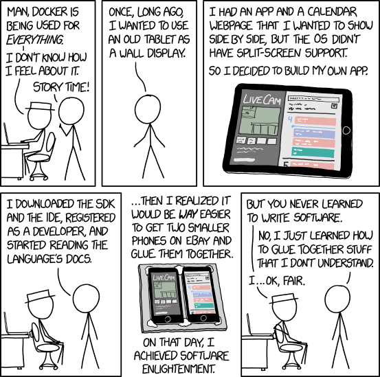

% Secure Software Design
% Andey Robins
% Spring 23 - Week 1

# Cybersecurity: Secure Software Design

## Course Aims

*The aim of this course:* provide students with an understanding of the software design lifecycle, cybersecurity, and most importantly, the overlap between the two. Students will get hands on experience designing, writing, and maintaining applications with security included as an integral component.

## Outline

- Syllabus & Housekeeping
- Software Design History
- Security Design Motivation

## Disclaimer

In this course, you will learn the techniques and processes employed by skillful attackers. We learn this for the explicit purpose of developing more secure systems and subverting potential attacks. We discuss the situations and boundaries of ethical security practice in this course and you are held to this high standard. **Do not attack any system or information without explicit prior written permission.** Not only is it a really bad idea, it’s probably illegal and a violation of UWYO network rules (UW Regulation 8-1) and the CEPS technology policy. I am not responsible for any actions you perform.

## Meeting Times

**Class:** MWF 8-8:50 am

**Office Hours:** M 11-12 & MR 1-2 & By Appointment

**Office:** EERB 228 (SSC Lab)

---


---


## Assignments

- Written Homework
- Programming Homework
- Midterm
- Final Project

## Structure

- Lecture presents concepts and gives examples
- Written homework assesses application of ideas
- Programming homework assesses ability to act on ideas

## Grading


## Late Work

- 75% credit up until the assignment is discussed in class

## 5010 Additional Topics

- Provable programs
- Zero-trust architecture
- Decentralized development
- Type theoretic security
- More/different as demanded (let me know if there are topics that sound interesting to you!)

## Languages

- Javascript/Typescript
- Go
- Rust

## Frameworks

- SvelteKit (TypeScript)
- Gin (Go)
- Rocket (Rust)

# Questions?

# The History of Software Engineering

## Outline

1. The Early Days (200 BCE - 1980s)
2. The Era of Personal Computing (1983 - 1990)
3. Web 1.0 (1991 - 1999)
4. The Dot Com Crash (2000 - 2005)
5. The Agile Age (2006 - 2009)
6. The Microservice Era (2010 - 2014)
7. The Emerging Serverless Era (2015 - Present)

# The Early Days

## The Antikythera Mechanism

- The antikythera mechanism (circa 200 BCE)

## Babbage's Analytical Engine

- Babbage Analytical Engine (1837)

## Ada Lovelace

- The first programmer (1842)

---

*"[The Analytical Engine] might act upon other things besides number, were objects found whose mutual fundamental relations could be expressed by those of the abstract science of operations, and which should be also susceptible of adaptations to the action of the operating notation and mechanism of the engine...Supposing, for instance, that the fundamental relations of pitched sounds in the science of harmony and of musical composition were susceptible of such expression and adaptations, the engine might compose elaborate and scientific pieces of music of any degree of complexity or extent."* - Ada of Lovelace

## The First Computed Algorithm

- Tom Kilburn
- the greatest divisor of 2^18 (262,144)
- 58 minutes to run

---

```python
print("Calculating the greatest divisor of 2^18")
n = 2 ** 18

for i in range(2, int(n ** 0.5)+1):
  if n % i == 0:
    print(f'The greatest divisor is {int(n / i)}')
    print(f'{n} / {int(n/i)} = {i}')
    return
```

--- 


## The Transistor

## First Compilers

- development of "programming" with first compilers and cobol/fortran

## COBOL

## Waterfall Design

- waterfall development (1970)

## C

- introduction of c (1972)

## The Apple II

- apple II and the beginning of personal computing
  - led to the creation of software development

# The Era of Personal Computing

## DRM introduced (1983)

## Word & Excel (mid 80s)

## Ping-Pong Virus & Cyberaids (1988)

## Therac-25

- Likely the first time a human died because of code issues
- Radiation therapy machine
- Delivered lethal doses of radiation to patients due to race conditions in the code

# Web 1.0

## The Internet (1991)

## Linux Kernel (1991)

## Design Patterns (GoF) (1994)

## Citibank Hack (1995)

## Php (1995)

## Java (1996)

## Mobile Devices
  
- First PDAs emerge in 1996
- Similar to the Apple II, led to the need for consumer software
- Began a process which is slowly replacing traditional computers

# The Dot Com Crash

## SaaS (1999)

- Salesforce launches their customer relationship management platform
- First instance of Software as a Service
- Changed the profit model for software businesses to this day

## ILOVEYOU (2000)

## mafiaboy (2000)

## US vs Microsoft (2001)

## agile (2001)

## Gary McKinnon and Military hacking (2001-2002)

## AWS (2002)

## Dot Com Crash

## Anonymous is first observed (2003)

## sandworm/voodoo bear is first observed (2004)

## Ruby & Rails (2004)

# The Agile Age

## jQuery (2006)

## The Iceman Hacks (2006)

## First iPhone (2007)

## Node (2009)

- Lots of people know Javascript, what if we wrote our servers with it?
- Led to the disaster that is NPM
- Can be credited with popularizing "full stack" development

## Vixen Panda is first observed (2009)

## The Lazarus Group is first observed (2009)

# The MicroService Era

## Angular (2010)

- Webpages are hard, so what if there was a way to act like they used older ideas?
- Angular was the first popular framework to emerge for building web applcations

## Microservices (2012)

## Electron (2013) 

- Writing native applications is hard
- Wouldn't it be nice to just release your webpage as an app?
- Electron is chromium bound to a single application
- Now everything can be web development :) 

## Docker (2013)

- Put work into a "container"
- Containers "run the same anywhere"
- Goes hand-in-hand and enabled with microservices

---



## React (2013)

## Footnote: React-native (2015)

- What if we took electron and its premise but made it for mobile?
- Write React code that runs a mobile app instead of a website

## Heartbleed (2014)

- One of the biggest vulnerabilities of the last decade
- Threatened virtually every server on the planet
- A common example in the textbook

---


## crypto, solidity, blockchain (2014)

# The Emerging Serverless Era

## Serverless (2015)

- The continuation of the move from:
  - Infrastructure aaS
  - Servers aaS
  - Functions aaS
- Began with the Serverless Framework

---

```go
func Handler(request events.APIGatewayProxyRequest) 
    (events.APIGatewayProxyResponse, error) {

	name := request.PathParameters["name"]
	message := fmt.Sprintf(
    " { \"Message\" : \"Hello %s \" } ", name
  )

	return events.APIGatewayProxyResponse{
    Body: message, StatusCode: 200
  }, nil
}
```

## Equifax breach (2017)

## PittyTiger is first observed (2017)

- PittyTiger, one of the most recent APTs is first seen
- Emerged 2017 
- Targeted AIRBUS Defense & Space
- Corporate Espionage
- Assumed not State Sponsored

## Crypto Bubble (2021)

## Lastpass Breach (2022)

## SvelteKit (2022)

# Major Trends

# Why Design in Security

## Major Threats

- APTs
- Crackers & Piracy
- Breaches
- Modern DDoS
  - Azure DDoS of 3.47 Tbps for 15 mins ~3 Petabytes of data ($63k alone just to store)

---

"""
The attacker used several networks to spoof 167 Mpps (millions of packets per second) to 180,000 exposed CLDAP, DNS, and SMTP servers, which would then send large responses to us. This demonstrates the volumes a well-resourced attacker can achieve: This was four times larger than the record-breaking 623 Gbps attack from the Mirai botnet a year earlier.
""" 
over 6 months