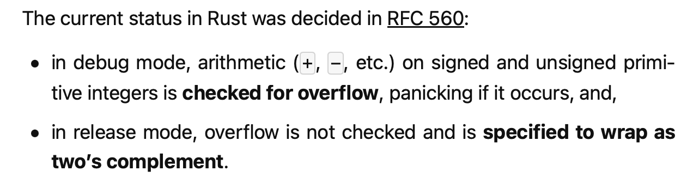

% Secure Software Design
% Andey Robins
% Spring 23 - Week 10

# Changes in the Second Half

1. Weeks 14 and 15, no class. Work on the final instead.
2. Code analysis moving to supplemental lecture
3. Dropping the Session Design assignment.
   1. See syllabus for point changes
4. A final "grade" will be manually entered at the end of the semester

## Midterm Notes

1. Protected vs Secret and tradeoffs
2. Ability to kill the software to keep things decrypted
3. Why always use a DB? Why not build on top of the unix filesystem?

# Secure Programming

## Outline

- Difficulties
- Attacks
- Common Vulnerabilities

## Why is it Difficult?

Ideas? I'll share some momentarily, but _what makes writing secure code difficult?_

---

1. Designing in security is not trivial and always different
2. Implementing designs cannot be done with any mistakes
3. Constant vigilance because one mistake might be all it takes
4. Quickly shifting requirements

## Vulnerabilities are Bugs

To rephrase our goals: instead of programming securely, we want to **avoid programming insecurely**.

"The challenge of secure coding largely amounts to not introducing flaws that become exploitable vulnerabilities."

---

A bug is an unintended effect in your code.

A vulnerability is a problem in your code which compromises some aspect of security.

Therefore, vulnerabilities are a kind of bug.

(As an aside, we could therefore conclude our problem is not writing secure code, but writing bug-free code.)

## Example

What are the security concerns of the following bugs?

1. We have a bug which causes our website not to render properly. All of the items are there, but they just don't look professional.
2. We have a bug which causes the admin interface to not require logging in to access and edit.
3. We have a bug which allows for you to bypass HTML sanitization before rendering if your profile has over 10,000 friends.

## We Just Ignore the Bugs That Don't Have Any Impact on Security

**Problem:** proving a bug doesn't have any security impacts will probably be more time-consuming than just fixing the bug.

## Easy Guide to Secure Programming

1. Don't mess up. Ever.

## Easy Guide to Secure Programming

1. Don't mess up. Ever.

<!-- whitespace hack -->
$$ $$

Obviously bad advice, "[professionals] have every intention of doing their best, and the added stress [of telling them not to mess up] only makes it harder to concentrade and do the job right."

## Malicious Influence 

Consider a car engine. If I give you a stick, what parts of the system can you influence?

## Malicious Influence 

Consider a car engine. If I give you a stick, what parts of the system can you influence?

What parts do those systems influence?

## Secure Programming For Real

1. How do attackers influence your code?
2. What can that code influence?
3. What can that influenced code influence?
4. ... etc.

_This is a process called tainting, see our code analysis supplemental lecture for more on taint analysis_

## Vulnerability Chains

When multiple bugs come together to form a path for exploitating, we call this a vulnerability chain.

## Example: Online Shopping Web App

After a recent code change, the app's order form allows for a customer to choose which warehouse will handle fulfillment instead of what previously happened: the backend handling warehouse assignment.

The bug, you have no way of knowing if the warehouse has your items in stock.

If the selected warehouse doesn't have the item in stock, it will get flagged and corrected on the backend.

---

A known bug sits in the report queue with Priority 3 (lowest) which was reported several years previously. 

The bug, if you place an order with the incorrect warehouse designation, the system immediately issues a refund because the warehouse is unable to fulfill it; however, another processing stage reassigns the order to the correct warehouse, fulfilling the order after a refund had already been issued.

This wasn't seen as an issue because there was no way for a customer to change the warehouse, so this was assigned priority 3. (i.e. it was purely hypothetical)

---

Now, a user could order some items from our store, modifying the warehouse field on the frontend. The system would then catch that the given warehouse does not have the item and issue a refund. The other part of the system would see that there was an order that has items at a different warehouse and re-assign the order. The products are shipped and the customer just got free stuff.

What was previously a theoretical bug and a simple user bug which would be caught have been combined into a vulnerability chain which gives you free stuff.

## Vigilance

Returning to this idea: "one mistake is all it takes to compromise security," the need for vigilance becomes much clearer.

What makes vigilance easier?

## Vigilance

Returning to this idea: "one mistake is all it takes to compromise security," the need for vigilance becomes much clearer.

What makes vigilance easier? **Knowing what can hurt you**

## An Analogy

When I cook, I'm always very careful about touching the stove and oven when they are turned on or in use. I turn pan handles in and use towels to remove items from the oven. I've built up an understanding of stove = hot from years of life.

I often forget the bucket of my air-frier is hot because I'm not used to treating it as a hot device. I start it cold, don't interact with it, and get hot food out.

## Building Vigilance

A large focus of the rest of the course will therefore be exposure to these "hot" ideas in programming. What are the things that cause a lot of bugs, how do we anticipate them, and what do we need to keep in mind in those situations.

## GotoFail Revisited

All code in this section under:

```c
/*
 * Copyright (c) 1999-2001,2005-2012 Apple Inc. All
    Rights Reserved.
 *
 * @APPLE_LICENSE_HEADER_START@
 *
 * This file contains Original Code and/or Modifications
    of Original Code
 * as defined in and that are subject to the Apple
    Public Source License
 * Version 2.0 (the 'License'). You may not use this
    file except in
 * compliance with the License. Please obtain a copy
    of the License at
 * https://www.opensource.apple.com/aps1/ and read it
    before using this file. */
```

---

```c
 /* The Original Code and all software distributed
    under the License are
 * distributed on an 'As IS' basis, WITHOUT WARRANTY
    OF ANY KIND, EITHER
 * EXPRESS OR IMPLIED, AND APPLE HEREBY DISCLAIMS
    ALL SUCH WARRANTIES,
 * INCLUDING WITHOUT LIMITATION, ANY WARANTIES OF
    MERCHANTABILITY,
 * FITNESS FOR A PARTICULAR PURPOSE, QUITE ENJOYMENT
    OR NON-INFRINGEMENT.
 * Please see the License for the specific language
    governing rights and
 * limitations under the License.
 *
 * @APPLE_LICENSE_HEADER_END@
 */
```

## GotoFail Commentary

Each call to `SSLHashSha1.update` must match an expected value to properly authenticate.

```c
if ((err =
   SSLHashSha1.update(&hashCtx, &clientRandom)) != 0)
      goto fail;
if ((err = 
   SSLHashSha1.update(&hashCtx, &serverRandom)) != 0)
      goto fail;
      goto fail;
if ((err = 
   SSLHashSha1.update(&hashCtx, &signedParams)) != 0)
      goto fail;

fail:
    SSLFreeBuffer(&signedHashes);
    SSLFreeBuffer(&hashCtx);
    return err;
```

## The Problem: Structure by Syntax

```c
if ((err = SSLHashSha1.update(&hashCtx, &serverRandom)) != 0)
    goto fail;
    goto fail;
```

Is syntactically equivalent to:

```c
if ((err = SSLHashSha1.update(&hashCtx, &clientRandom)) != 0) {
    goto fail;
}

goto fail;
```

## Mitigation

Remove one of the `goto fail;` lines.

```c
if ((err = SSLHashSha1.update(&hashCtx, &clientRandom)) != 0)
    goto fail;
```

## Footguns

_A footgun is a feature which makes it easy to shoot yourself in the foot_

## Where are the Footguns?

```c++
// from a guess my number game
if (myNum = guess)
   cout << "You guessed my number!" << endl;
else if (myNum < guess)
   cout << "Too high!" << endl;
else
   cout << "Too low!" << endl;
```

## Avoiding Footguns

1. Compiler warnings
2. Linters
3. Code review
4. Reading/PD

## Vulnerabilities

_All happy families are alike; each unhappy family is unhappy in its own way._ - Leo Tolstoy

$$ $$

Secure code is all the same, vulnerabilities are the differences in this analogy.

## Atomicity

Code will be running in parallel, whether you have multi-threaded code or not. When your code is the multi-threaded part, we're all familiar with the problems that can arise in the form of race-conditions, deadlock, etc.

*Atomicity* is the response, stating that operations which are atomic are guaranteed to effectively be completed in a single step. 

## Example: Python Atomicity of Files

```py
fname = tempfile.mktemp()
with open(fname, "w+") as f:
   f.write("My super sensitive, secret info")
```

## Example: Truly Atomic Python Files

```py
with open(tempfile.NamedTemporaryFile, "w+") as f:
   f.write("My super sensitive, secret info")
```

## Multithreaded Machines

A key reminder for working with atomic code is that everything runs in a parallel environment in modern software.

- Assume interactions with the outside world can hit this system
- Plan for atomic operations to play defensively

## Timing Attacks

**Timing Attacks** are side-channel attacks which use information about the execution time to infer information about the system state.

---


## Mitigating Timing Attacks

"The best mitigation option is to reduce the time differential to an acceptable level."

1. Remove/refactor sequential logic
2. Defer returning until after all checks
3. Add artificial delays

## Serialization

_Serialization_ is the technique of converting objects to a byte stream. This stream can then be transmitted, saved, or otherwise used to allow objects to move between systems.

## A Question of Trust

Serialization is a very useful, important tool for developers. Pickling and unpickling datasets and ML models is one specific instance of this which is widespread.

The problem isn't that serialization doesn't do the necessary "leg work" to be secure, but it is inherently relying on trust in the serialized data.

## The Usual Suspects

The following collection of "issues" tend to keep cropping up no matter what we do to try to banish them from the software world.

---

These will seem obvious, and I probably am not the first person to tell you about these problems.

$$ $$

They continue to be some of the most costly bugs and vulnerabilities to this day.

## Fixed-Width Integer Vulnerabilities

What does the following C code do?

```c
#include <stdio.h>

unsigned char cost = 200;
cost = cost * 0.5 + cost;
printf(cost); // 44
```

## The Problem

When we need to represent numbers beyond the size of what our processor can represent, the addional bytes are just "discarded." In other words, operations are performed under modular arithmetic where our modulus is 2 to the power of the width.

## Floating-Point Precision Vulnerabilities

What does this javascript do?

```js
if (0.1 + 0.2 === 0.3) {
   console.log('Equal');
} else {
   console.log('Not Equal');
}
```

## IEEE 754


## Examples: Underflow and Overflow

Some specific examples are presented in the textbook for both of these scenarios.

Why am I not going to spend any time talking about them?

## Rust and Under/Overflow



## Safe Arithmetic

With all this said, what should you do about numeric representations?

1. Take extra caution during type coercion (i.e. look for truncation/distortion)
2. Constrain input values and assert those bounds
3. Use extra-large datastructrues
4. Watch intermediate values as potentially unchecked locations
5. Test, test, test

Alternatively, just use a big number option

## Memory Management

```c
uint8_t *p;
// don't use p before this
p = malloc(100); // allocate 100 bytes
p[0] = 1;
p[99] = 123 + p[0];
free(p); // release the memory again
// now don't use p again, pinky promise?
```

## Use After Free

When we make use of (i.e. access, attempt to update, or otherwise interact with) pointers, nothing ties the lifetime of that pointer to the lifetime of the memory we allocate for it.

In other words, we can still use `p` after we have freed the memory that the pointer points to.

## So What?

The results of use after free are laregly undefined, and could be as simple as crashing, or they could allow for reading arbitrary sections of memory without any restrictions.

## Buffer Overflow

```c
uint8_t *p;
p = malloc(100); // allocate 100 bytes
p[0] = 1;
p[100] = 123 + p[0]; // overflow
free(p);
```

## So What?


## Leaking Memory

```c
uint8_t *p;
p = malloc(100); // allocate 100 bytes
p[0] = 1;
p[100] = 123 + p[0]; // overflow
// free(p); oops i forgot this
```

# Questions?

## Next Time

- Untrusted Input
- Input Validation
- Injections